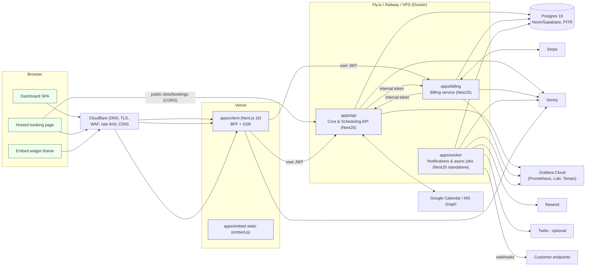

# MVP 01 — Architecture, service decomposition, technology stack

## 1. Design goals for Phase 1

- A solo developer ships to paying users in ~2 weeks.
- "Microservices" means **independently deployable processes with explicit
  ownership boundaries**, not distributed complexity. We accept a shared
  Postgres instance and synchronous HTTP between services where it is simplest.
- Every shortcut is a documented seam that Phase 2 can cut along (see
  `full-scale/11-migration-roadmap.md`).
- Everything runs locally with `docker compose up` + `pnpm dev`.

## 2. Service map



### 2.1 Services and responsibilities

| Service | Repo path | Kind | Owns (tables) | Responsibilities |
| --- | --- | --- | --- | --- |
| **Core & Scheduling API** | `apps/api` | NestJS HTTP, port 3001 | users, refresh_tokens, user_tokens, organizations, memberships, invitations, schedules, availability_rules, date_overrides, event_types, bookings, customers, calendar_connections, connected_calendars, external_busy_blocks, api_keys, webhook_endpoints, webhook_deliveries, domain_events, idempotency_keys, audit_logs | Auth (exists), tenancy, RBAC, scheduling engine, bookings, customers, calendar OAuth + sync, developer API surface, webhook endpoint management, outbox writes |
| **Billing service** | `apps/billing` | NestJS HTTP, port 3002 | products, prices, stripe_customers, subscriptions, credit_ledger_entries, payments, refunds, invoices, stripe_events, platform_accounts | Stripe Connect onboarding, catalog sync, Checkout sessions (one-time & subscription), Stripe webhook ingestion, subscription/invoice mirroring, credits/entitlements, refunds, platform (SchedFlow) plans |
| **Worker** | `apps/worker` | NestJS standalone (no HTTP except `/health`, `/metrics` on 3003) | notification_logs | pg-boss consumers: outbox relay, email/SMS rendering & sending, reminders, webhook dispatch with retries, calendar sync/polling & writes, booking expiry, credit period refill, cleanup |
| **Client** | `apps/client` | Next.js 16 on Vercel | — | Dashboard (auth via NextAuth, BFF to api/billing), hosted booking page (SSR + client slot picker), embed target |
| **Embed** | `apps/embed` | Static JS bundle (Vite lib) | — | `embed.js` that injects popup/inline iframe of the booking page, postMessage bridge |

**Where is the "API gateway"?** In Phase 1 the gateway responsibilities are
split between (a) Cloudflare (TLS, WAF, IP rate limiting, caching of static and
public slot responses) and (b) the Next.js BFF for browser traffic (keeps the
user JWT in an httpOnly cookie; the browser never holds API credentials).
Developer traffic goes straight to `api.schedflow.com` (`apps/api`) with API
keys. A standalone gateway service would add a hop and a deployable with no
Phase 1 benefit. Phase 2 introduces Envoy/Kong (`full-scale/01-architecture.md`).

### 2.2 Shared packages

| Package | Purpose |
| --- | --- |
| `packages/db` (`@shedflow/db`) | **Single Prisma schema + generated client + migrations** for the shared Postgres. Services import the client; ownership of tables is by convention (matrix above) and verified in code review. Moving `apps/api/prisma` here is task `T-001`. |
| `packages/shared` (`@shedflow/shared`) | Zod schemas and TS types for API DTOs & webhook payloads, domain event names, error codes, constants (limits), money/time helpers. Used by api, billing, worker, client. |
| `packages/ui` (`@shedflow/ui`) | shadcn/ui components (already exists), theme tokens, Tailwind preset. |
| `packages/emails` (`@shedflow/emails`) | React Email templates rendered by the worker, previewable locally. |
| `packages/typescript-config` | Shared tsconfig (exists). |

## 3. Communication patterns

| From → To | Pattern | Why |
| --- | --- | --- |
| Browser → client (Next) | HTTPS, cookies | NextAuth session cookie; BFF pattern already implemented |
| client → api / billing | Sync HTTP, `Authorization: Bearer <user JWT>` | Existing `apiFetch`; same JWT accepted by both services (shared `JWT_SECRET` in Phase 1, JWKS in Phase 2) |
| Booking page (browser) → api | Sync HTTPS to `/v1/public/*`, CORS `*` | Public, unauthenticated, cacheable; avoids double hop through Vercel for the latency-critical slot query |
| api ↔ billing | Sync HTTP `/internal/*` with `X-Internal-Token` (HMAC of body + timestamp) | Only 4 calls (create checkout, get entitlement, consume credit, release credit); sync keeps booking flow simple |
| api / billing → worker | **Outbox** (`domain_events` table written in the same transaction) → relay job → pg-boss queues | Guarantees at-least-once delivery without a broker; transactional with business writes |
| worker → api / billing | Direct DB reads for rendering (shared DB) + `/internal/*` HTTP for mutations (e.g. mark booking `EXPIRED`) | Reads are cheap; mutations go through owning service to keep invariants in one place |
| Stripe → billing | Webhooks `/webhooks/stripe` (signature verified) | Standard |
| Google → api | Push notifications `/webhooks/google-calendar` (+ polling fallback) | Standard |
| worker → external | Resend, Twilio, customer webhook URLs, Google/Graph APIs | Retried by pg-boss |

## 4. Technology stack and justification

| Concern | Choice | Justification (Phase 1) |
| --- | --- | --- |
| Language | TypeScript everywhere (Node 22 LTS) | One language for a solo dev; shared types between services and UI |
| Backend framework | NestJS 11 | Already in use; DI makes ports/adapters natural; standalone app mode for worker |
| ORM / migrations | Prisma 7 (`@prisma/adapter-pg`) | Already in use; migrations committed; raw SQL migrations for exclusion constraints and extensions |
| Database | PostgreSQL 16 (managed: Neon or Supabase; local: docker) | `tstzrange` + `btree_gist` exclusion constraint = DB-guaranteed no double booking; one datastore for data **and** jobs |
| Job queue | **pg-boss** (Postgres-backed) | No Redis to run; delayed jobs (`startAfter`) for reminders/expiry; retries with backoff; singleton keys for dedupe; `LISTEN/NOTIFY`-free polling is fine at MVP volume. Swap for BullMQ/Redis or Kafka in Phase 2 behind `JobQueue` port |
| Auth | Existing Passport JWT (+ refresh rotation), NextAuth v5 in client | Already built; no vendor lock-in |
| Payments | Stripe (Connect Express, Checkout, Billing, Tax, Customer Portal) | Everything (proration, invoicing, dunning, tax, PCI) is delegated; SAQ A scope |
| Email | Resend + React Email | Simple API, good deliverability, templates in TSX with previews |
| SMS (optional) | Twilio | Industry default; behind `SmsProvider` port |
| Calendar | Google Calendar API (googleapis), Microsoft Graph | Required integrations |
| Date/time | `date-fns` v4 + `@date-fns/tz` (`TZDate`) | Tree-shakable, DST-correct zone math; `Intl` for formatting |
| Validation | `class-validator` in Nest (exists) + `zod` schemas in `@shedflow/shared` for client/webhook payloads | Keep existing controller convention; zod gives shared runtime types to the frontend |
| Frontend | Next.js 16 App Router, React 19, Tailwind 4, shadcn/ui (`@shedflow/ui`), TanStack Query, react-hook-form + zod, `next-intl` | shadcn is mandated; App Router already in use |
| Embed | Vite library build, vanilla TS, < 8 KB gz | No framework in host pages |
| Logging | pino (`nestjs-pino`) JSON, `x-request-id` | Cheap structured logs |
| Metrics | `prom-client` `/metrics` scraped by Prometheus (compose stack exists) or Grafana Agent → Grafana Cloud | Reuses existing observability compose |
| Tracing | OpenTelemetry Node SDK, OTLP → Tempo (Grafana Cloud free tier) | One env var to turn on |
| Errors | Sentry (api, billing, worker, client) | Alerting on exceptions with release tagging |
| Feature flags | Env + `organizations.settings.flags` JSON + `@shedflow/shared` `Flags` enum | No new vendor; Phase 2 → OpenFeature/Unleash |
| Hosting | Vercel (client, embed); Fly.io **or** Railway **or** a single VPS with Docker Compose + Caddy (api, billing, worker); Neon/Supabase Postgres | See `12-infrastructure-cicd-dr.md` for the three supported topologies |
| CI/CD | GitHub Actions + Turborepo remote cache | Already Turbo-based |
| IaC | Terraform for Cloudflare + Fly/Neon resources (small), `fly.toml`/`railway.json` per service, `docker-compose.prod.yml` for VPS | Enough to recreate environments |

## 5. Repository layout after MVP

```
apps/
  api/            Core & Scheduling API (NestJS)
    src/
      auth/  users/  organizations/  memberships/  invitations/
      schedules/  event-types/  availability/  bookings/  customers/
      calendar/{google,microsoft}/  api-keys/  webhooks/  audit/
      common/{persistence,http,tenancy,idempotency,events,security}
      internal/   (routes for service-to-service calls)
      public/     (unauthenticated /v1/public routes)
  billing/        Billing service (NestJS)
    src/
      connect/  catalog/  checkout/  subscriptions/  credits/  payments/  invoices/
      stripe/{webhooks,client}  platform/  internal/  common/
  worker/         Async jobs (NestJS standalone + pg-boss)
    src/
      queue/  outbox/  notifications/  reminders/  webhooks/  calendar-sync/  expiry/  credits/
  client/         Next.js dashboard + booking pages
    app/
      (auth)/login  (auth)/register  (auth)/reset-password  (auth)/verify-email  (auth)/invite/[token]
      (dashboard)/[orgSlug]/{overview,event-types,availability,bookings,customers,billing,team,settings,developer}
      (public)/[orgSlug]/[eventSlug]  (public)/b/[bookingUid]/{manage,cancel,reschedule,pay}
      api/{auth,register,bff}/...
  embed/          embed.js (Vite)
packages/
  db/             Prisma schema, migrations, generated client
  shared/         zod DTOs, event names, error codes, constants
  ui/             shadcn components
  emails/         React Email templates
  typescript-config/
observability/    Prometheus, Grafana, Alertmanager config (exists) + alerts/*.yml
docker/           local Postgres init
docs/design/      this documentation
tasks/            implementation tasks
```

## 6. Key request flows

### 6.1 Slot query (public)

```mermaid
sequenceDiagram
  participant B as Booking page (browser)
  participant CF as Cloudflare
  participant A as apps/api
  participant PG as Postgres
  participant G as Google Calendar
  B->>CF: GET /v1/public/orgs/{org}/event-types/{slug}/slots?from&to&tz
  CF->>A: (cache miss; TTL 30s keyed on URL)
  A->>PG: load event type, schedule, rules, overrides, bookings in range (busy ranges)
  A->>PG: load external_busy_blocks for host's conflict calendars in range
  alt cache stale (> 60s) for that host/range
    A->>G: freebusy.query (timeout 2s; on failure use cached blocks, flag stale=true)
  end
  A-->>B: 200 { slots: [...], timezone, stale }
```

### 6.2 Paid booking

```mermaid
sequenceDiagram
  participant B as Browser
  participant A as apps/api
  participant PG as Postgres
  participant BL as apps/billing
  participant S as Stripe
  participant W as apps/worker
  B->>A: POST /v1/public/bookings (Idempotency-Key)
  A->>PG: BEGIN; INSERT booking(status=PENDING_PAYMENT, expires_at=now+15m) — exclusion constraint guards slot
  A->>PG: INSERT domain_event booking.payment_required; COMMIT
  A->>BL: POST /internal/checkout-sessions {bookingId, priceId, customer, successUrl, cancelUrl}
  BL->>S: checkout.sessions.create (on connected account, application_fee)
  BL->>PG: INSERT payment(status=REQUIRES_PAYMENT)
  BL-->>A: { url }
  A-->>B: 201 { booking, payment: { checkoutUrl } }
  B->>S: redirected to Checkout, pays
  S->>BL: webhook checkout.session.completed
  BL->>PG: idempotent insert stripe_events; UPDATE payment SUCCEEDED; INSERT domain_event payment.succeeded
  W->>PG: relay: payment.succeeded → job booking.confirm
  W->>A: POST /internal/bookings/{id}/confirm
  A->>PG: UPDATE booking CONFIRMED; INSERT domain_event booking.confirmed
  W->>W: relay booking.confirmed → email.send, calendar.write, webhook.dispatch, reminders.schedule
```

### 6.3 Expiry of unpaid hold

`booking.payment_required` → worker schedules `booking.expire` with
`startAfter = expires_at`. Job calls `POST /internal/bookings/{id}/expire`; api
sets `EXPIRED` only if still `PENDING_PAYMENT` (compare-and-set) and emits
`booking.expired`; billing expires the Checkout Session (`expires_at` on the
session is also set to the same time as a belt-and-braces).

## 7. Environment configuration (all services)

Every service validates its env at boot with a zod schema (`config/env.ts`) and
refuses to start if anything is missing. Names are shared across services.

| Variable | api | billing | worker | client | Notes |
| --- | --- | --- | --- | --- | --- |
| `NODE_ENV`, `PORT`, `LOG_LEVEL` | ✓ | ✓ | ✓ | ✓ | |
| `DATABASE_URL` | ✓ | ✓ | ✓ | | Pooled URL (pgbouncer/Neon pooler) |
| `DIRECT_DATABASE_URL` | ✓ | | | | For migrations only |
| `JWT_SECRET`, `JWT_ACCESS_TTL=15m`, `JWT_REFRESH_TTL=30d` | ✓ | ✓ (verify only) | | | Shared secret in Phase 1 |
| `INTERNAL_API_SECRET` | ✓ | ✓ | ✓ | | HMAC for `/internal/*` |
| `ENCRYPTION_KEY` (32 bytes base64) | ✓ | ✓ | ✓ | | AES-256-GCM for OAuth tokens, webhook secrets |
| `APP_URL` (client), `API_URL`, `BILLING_URL` | ✓ | ✓ | ✓ | ✓ | |
| `STRIPE_SECRET_KEY`, `STRIPE_WEBHOOK_SECRET`, `STRIPE_CONNECT_WEBHOOK_SECRET`, `STRIPE_PLATFORM_FEE_BPS=200` | | ✓ | | | |
| `STRIPE_PRICE_PRO_MONTHLY`, `STRIPE_PRICE_PRO_YEARLY` | | ✓ | | | Platform plan prices |
| `GOOGLE_CLIENT_ID`, `GOOGLE_CLIENT_SECRET`, `GOOGLE_WEBHOOK_URL` | ✓ | | ✓ | | |
| `MS_CLIENT_ID`, `MS_CLIENT_SECRET`, `MS_TENANT=common` | ✓ | | ✓ | | |
| `RESEND_API_KEY`, `EMAIL_FROM`, `TWILIO_*` | | | ✓ | | |
| `SENTRY_DSN`, `OTEL_EXPORTER_OTLP_ENDPOINT`, `OTEL_EXPORTER_OTLP_HEADERS` | ✓ | ✓ | ✓ | ✓ | |
| `AUTH_SECRET`, `AUTH_URL`, `NEXT_PUBLIC_API_URL`, `NEXT_PUBLIC_EMBED_URL` | | | | ✓ | NextAuth + public API base for booking page |
| `FLAGS` (comma list) | ✓ | ✓ | ✓ | ✓ | Global feature flags |

## 8. Ownership rules for the shared database

1. A table has exactly one owning service (matrix in §2.1). Only the owner
   **writes** to it. Other services may **read** it.
2. Cross-service references are plain UUID columns without FK constraints
   (`event_types.price_id`, `bookings.payment_id`, `stripe_customers.customer_id`).
   Referential integrity across boundaries is enforced by the owning service's
   API, not the DB, so Phase 2 can move tables to separate databases without
   schema changes.
3. All migrations live in `packages/db/prisma/migrations` and are applied by a
   single `migrate` job before any service deploys.
4. Tenant-owned tables always carry `organization_id` and an index that starts
   with it.

## 9. Deliberate simplifications and their Phase 2 replacement

| Simplification | Risk accepted | Phase 2 |
| --- | --- | --- |
| Shared Postgres, ownership by convention | Accidental cross-writes | Database per service; CDC |
| Shared `JWT_SECRET` for token verification in billing | Secret sprawl | Identity service with JWKS, short-lived tokens |
| Sync HTTP api↔billing | Coupled availability | Async sagas over Kafka |
| pg-boss in Postgres | Throughput ceiling (~1k jobs/s) | Kafka + dedicated workers |
| Worker reads other services' tables | Coupling | Read models via events |
| Polling Google Calendar every 5 min + freebusy at query time | Slight staleness | Push channels + incremental sync everywhere |
| Offset pagination | Deep pages slow | Cursor pagination |
| No RLS | Relies on repository discipline | Postgres RLS with `SET app.org_id` + service DB roles |
